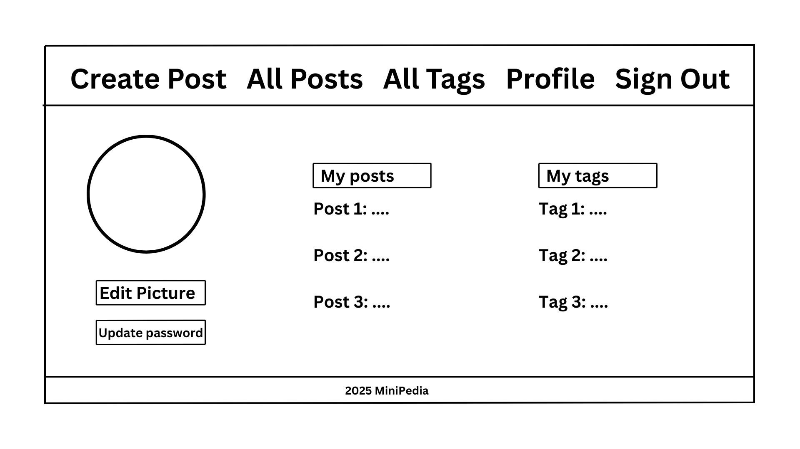
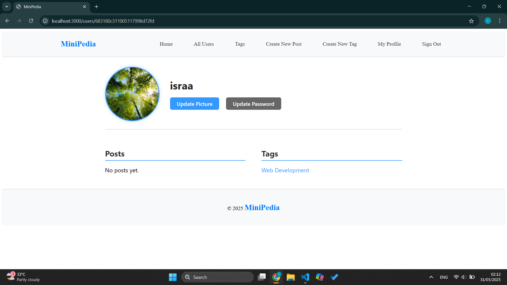

# GA Project 2: MiniPedia

## 📌 Summary
MiniPedia is a collaborative online encyclopedia that allows registered users to create, edit, and tag posts. The platform supports community-driven contributions with optional collaborative editing and user profile management. Designed with an intuitive interface, MiniPedia provides a space for structured, accessible knowledge-sharing.

### 👥 Collaborators
- Sayed Mustafa Sharaf
- Israa Sayed Faisal Alwedaei  

---

## 🧩 ERD of the System Models
### ERD of the System Models

*Entity Relationship Diagram (ERD) of the MiniPedia system models*

---

## 🧠 WireFrame of the System
### Home Page 

*Home page of MiniPedia welcoming users and providing navigation options.*

### Sign Up Page
  
*Sign up page for new users to create an account.*

### Sign In Page
  
*Sign in page where existing users can log into their accounts.*

### Create Post/Tag Page
  
*Interface for users to create a new post or tag.*

### All Posts Page
  
*All Posts page displaying all user-submitted encyclopedia entries.*

### All Tags Page
  
*Figure: All Tags page showing a list of available tags used across posts.*

### Post Page
  
*Detailed view of a single post including content, images, related tags, edit, and delete the post.*

### Tag Page
  
*Tag detail page showing description of the tag, all posts associated with a specific tag, edit, and delete the tag.*

### Profile Page
  
*User profile page with options to manage posts, tags, and profile settings.*

---

## 📋 Trello Board
You can view our planning and progress on the [MiniPedia Project 2 Trello Board](https://trello.com/b/GBkdhXYC/minipedia-project-2).

---

## 🖼️ Screenshots from Browser

### Sign In Page
  
*The login page for existing users.*

### User Profile Page
  
*Profile page showing user info, post history, and tag management.*

### A User Profile Page
  
*Example of a specific user profile view.*

### All Users Page
  
*Admin view of all registered users.*

### All Posts Page
  
*List of all posts available on the platform.*

### Show Post Page
  
*Detailed view of a single post.*

### Create New Post Page
  
*Form for users to create a new post.*

### Create New Tag Page
  
*Form for users to create a new tag.*

---

## 🚀 Getting Started

### 🔗 Browse It Live
Go Live: 

### 🧭 How to Go Through It
1. **Sign Up / Sign In**  
   - Use the navigation bar to register a new account or log in with existing credentials.

2. **Create and Manage Posts**  
   - Once logged in, access the **Create** button to add a new post or tag.
   - Fill in the title, description, optional image URL, and tags.
   - Choose whether your post can be publicly edited by others.

3. **Explore Tags and Posts**  
   - Use the **All Tags** and **All Posts** options in the navbar to browse existing content.
   - Click on a tag to see all posts associated with it.

4. **Edit Profile**  
   - Head to your **Profile** to update your picture, password, and view your posts.

5. **Admin Functions** (If applicable)
   - Admins can remove any post and edit user profiles.

---

## 🧰 Used Technologies

- HTML
- CSS
- EJS
- Node.js
- Express.js
- MongoDB
- Mongoose
- bcrypt
- express-session
- Git & GitHub

---

## ✨ Features

- ✅ User registration and login with profile management
- ✅ Post and tag creation with optional image and public editing toggle
- ✅ Editing/deleting own posts
- ✅ Optional collaborative editing with author tracking
- ✅ Tagging system (view, assign, and browse)
- ✅ “Edited by” attribution for collaborative changes
- ✅ Version control of post history (last 3 edits)
- ✅ Admin capabilities to manage user content

---

## 🧾 User Stories

### **User**
- As a user, I want to be able to see the login and signup options.
- As a user, I want to be able to sign up and log in to protect my information.
- As a user, I want to post multiple posts.
- As a user, I want to be able to edit posts that are allowed to be edited.
- As a user, I want to have the option to include a picture in my post.
- As a user, I want to be able to edit my profile.
- As a user, I want to be able to see all available tags and browse all posts within each tag.
- As a user, I want to be able to create a tag.

### **Admin**
- As an admin, I want to be able to delete any post.
- As an admin, I want to be able to edit any user profile.
- As an admin, I want to be able to use all normal user functionalities.

---

## 💡 Pseudo Code

```plaintext
IF user registers
    THEN save user info to database
    ALLOW login with credentials

IF user is logged in
    DISPLAY options to create/edit posts and manage profile

WHEN user creates post
    VALIDATE input fields
    SAVE post with userID
    IF post allows edits
        ENABLE other users to edit
        TRACK edit history and editor name
        MAINTAIN last 3 versions using queue

WHEN user creates a tag
    ADD tag to tag table
    LINK tag to post

ON clicking a tag
    DISPLAY all related posts

IF user is admin
    SHOW delete/edit buttons for all posts and profiles
```

---

## 🛠️ Next Features (Future Enhancements)

- 🔒 Email verification and password reset via email
- 🧵 Commenting system under each post
- 🧠 Advanced search and filtering for posts/tags
- 📚 Nested tagging or categories
- ⏳ Pagination or infinite scroll on post lists
- 📈 Analytics for post views or top contributors
- 🔔 Notifications for post edits or tag follows
- 🧑‍⚖️ Admin dashboard with user management panel

---